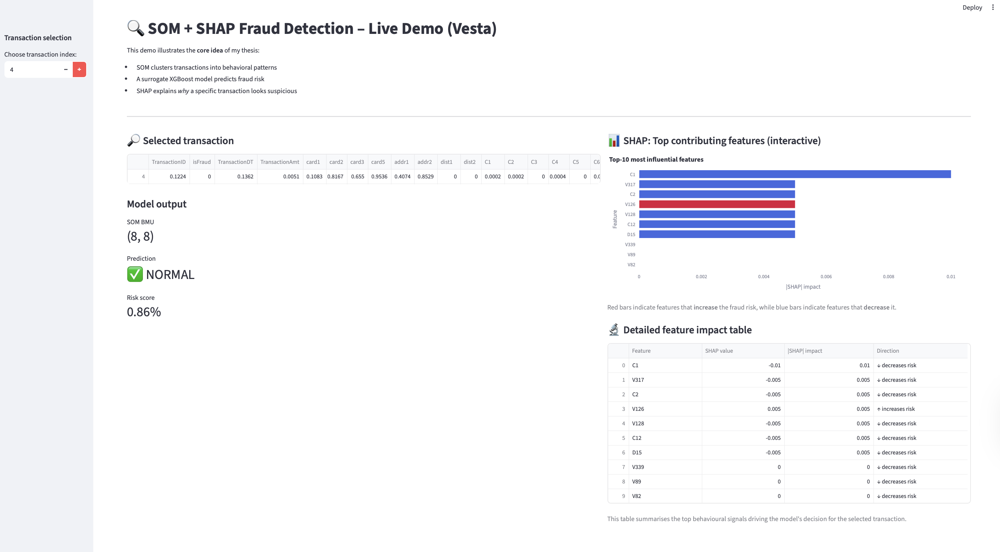
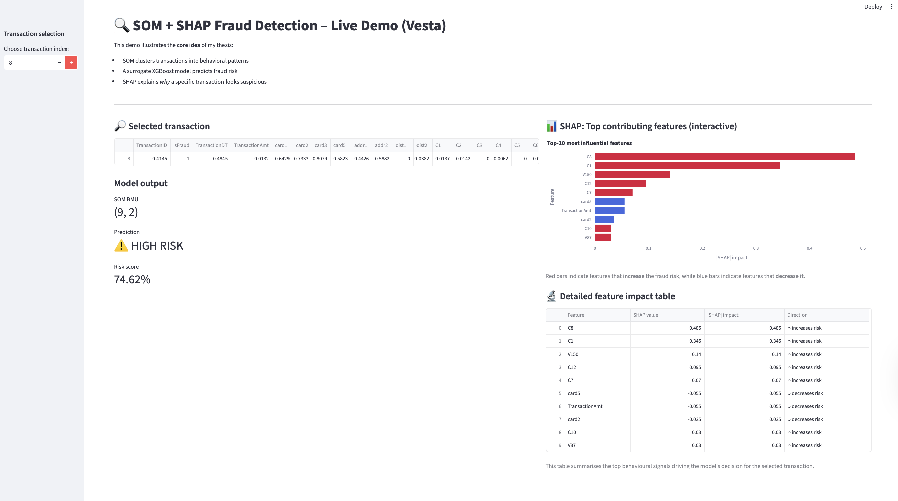

# SOM + SHAP Fraud Detection  
### Explainable Unsupervised Fraud Detection Framework

This repository contains a fully working, explainable, unsupervised fraud detection framework developed as a **portfolio-grade research & engineering project**.

The system combines **Self-Organizing Maps (SOM)** for behavioral clustering with **SHAP** for transparent, feature-level explanations, and includes an **interactive Streamlit demo** for exploration and visualization.

---

## 🎯 Project Motivation

Fraud detection in real financial systems faces several key challenges:

- Extreme class imbalance (fraud < 0.5%)
- Delayed or missing labels (chargebacks arrive weeks later)
- Evolving fraud patterns (concept drift)
- Regulatory requirements for transparency and auditability

Most existing approaches focus either on **accuracy** or **interpretability**, but rarely on both — especially in **unsupervised settings**.

This project aims to bridge that gap.

---

## 🚀 Key Contributions

- ✅ Fully unsupervised fraud detection (no fraud labels required)
- ✅ Behavioral clustering using Self-Organizing Maps (SOM)
- ✅ Explainability layer using SHAP via a surrogate XGBoost model
- ✅ Global & local explanations (clusters + individual transactions)
- ✅ Cross-domain validation (CreditCard, PaySim, Vesta)
- ✅ Interactive Streamlit demo for analysts and auditors

---

## 🧠 Method Overview

High-level pipeline:

1. Input data from different financial domains  
2. Feature scaling (label-free preprocessing)  
3. SOM clustering to build a 2D behavioral map  
4. U-Matrix analysis to identify dense vs anomalous regions  
5. Pseudo-label generation from SOM clusters  
6. Surrogate XGBoost model trained to replicate SOM decisions  
7. SHAP explanations applied on the surrogate model  
8. Evaluation & visualization via Streamlit  

This design enables **explainability without supervision**.

---

## 📊 Datasets

The framework was evaluated across three complementary datasets:

| Dataset     | Domain         | Purpose                                  |
|------------|----------------|------------------------------------------|
| CreditCard | Card payments  | Clean baseline, PCA features              |
| PaySim     | Mobile money   | Domain shift & behavioral flows           |
| Vesta      | E-commerce     | High-dimensional, real-world complexity  |

This repository includes a **demo version of the Vesta dataset** for reproducibility.

---

## 🖥️ Interactive Streamlit Demo

Below are examples from the interactive Streamlit dashboard showing  
both **normal** and **high-risk** transactions with SHAP-based explanations.

### ✅ Normal transaction (low risk)



---

### ⚠️ High-risk transaction (flagged by the model)



The dashboard allows analysts to inspect:
- SOM cluster assignment
- Risk score
- Top SHAP features driving the decision
- Feature-level impact direction (increase / decrease risk)

---

## ▶️ Run the Demo Locally

```bash
# clone the repository
git clone https://github.com/MazurPavel/som-shap-fraud-detection.git
cd som-shap-fraud-detection

# install dependencies
pip install -r requirements.txt

# launch Streamlit app
python3 -m streamlit run src/app.py

The app will open in your browser at:
http://localhost:8501

📂 Repository Structure
som-shap-fraud-detection/
├── data/        # Demo dataset (Vesta sample)
├── models/      # Pre-trained SOM, XGBoost & SHAP objects (.pkl)
├── src/         # Source code (Streamlit app & training scripts)
├── assets/      # Screenshots used in README
├── README.md
├── LICENSE
└── .gitignore

📈 Results Summary
	•	Strong clustering quality (Silhouette score up to ~0.57)
	•	High precision on fraud detection (≈ 0.95 on Vesta)
	•	Better F1-score than Isolation Forest, DBSCAN, Autoencoders
	•	Meaningful SHAP explanations for false positives
	•	Stable performance across domains

Importantly, explainability did not come at the cost of performance.

⸻

🧩 Why This Project Is Novel
	•	Uses SHAP in an unsupervised setting
	•	Explains clusters, not just predictions
	•	Combines topological SOM maps with feature-level attributions
	•	Designed with audit & regulatory readiness in mind
	•	Demonstrates how explainable AI can support human fraud analysts

⸻

🔮 Future Work
	•	Real-time / streaming SOM variants
	•	Faster SHAP approximations for large-scale deployment
	•	Counterfactual explanations (“what would make this transaction normal?”)
	•	Hybrid models (SOM + LSTM / Transformers)
	•	Analyst-in-the-loop dashboards

